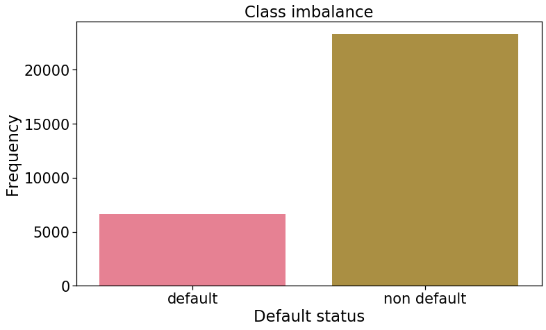
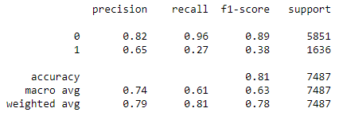
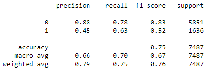
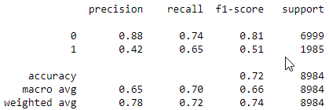
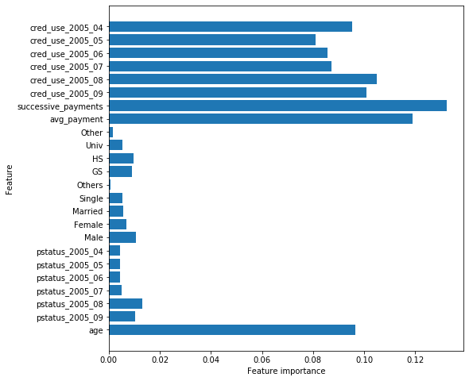
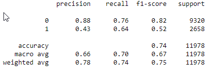
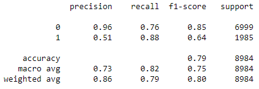

# Table of contents

- Purpose

- Synopsis

- Analysis

- Wayforward

# Purpose

Given the Taiwan credit card default dataset. Can we correctly classify whether a customer will default on their next payment. The dataset consists of payment history for a 6 month period. April 2005 to September 2005. Based on this information will month 7 be default or not. This is a binary classification problem.

This README will also serve as a general outline and explanation of the analysis and development process.


# Synopsis

An exploration into the dataset showed that sex, marriage status and education weren't importance features when predicting the default status. I found the XGboost model provided the best recall value of 0.88 for a true positive value. Precision was 0.51 and the F1 score was 0.64. Using GridsearchCV allowed me to get to the optimal parameters for XGboost to get to this recall value.

I have decided that the recall value is more important when optimising the models due to the importance of being able to correctly identify actual positives, actual defaults. The precision is only 0.51, this means many customers that wouldn't be defaulting would also be identified as defaulting. The department responsible for managing risk for the credit card company would need to make a decision on what action needs to be taken. For example, if a credit card customer that isn't going to default gets flagged a letter or notification could be sent informing that in the event of difficulties making payments he/she is able to contact the customer service team see if any help can be given. This way it will be a positive interaction with the customers in general but may help prevent default before it happens to true positives for default.


**Logistic regression model** - This produced a recall value for predicting default of 0.63 and precision of 0.45, F1-score of 0.52
Sampling method: SMOTE

**Decision tree model** - This produced a recall value for predicting default of 0.65 and precision of 0.42, F1-score of 0.51
Sampling method: RandomOverSampling

**Random Forest model** - This produced a recall value for predicting default of 0.64 and precision of 0.43, F1-score of 0.52 Sampling method: RandomOverSampling

**XGboost Model** - This produced a recall value for predicting default of 0.63 and precision of 0.88, F1-score of 0.64
Sampling method: No resampling used due to Gridsearch producing an error with the resampled data. scale_pos_weight=5 was used to compensate for the imbalanced data.

# EDA and Feature engineering

## Class imbalance

The class imbalance is high in this dataset, and therefore different sampling techniques such as oversamplying, undersampling, adjusting weights to counter the imbalance.




## Features

1. Credit Usage - An monthly indicator comparing the balance and credit limit. (Balance / Credit limit). This is a monthly feature, for example cred_use_2005_09 - cred_use_2005_04


2. avg_payment - Average of the 6 months payments.


3. successive_payments - How many payments that are back to back. I have assumed that this is a sign of stability, the less successive payments the more likely a customer is to default.


4. always_paid - A flag that indicates whether a customer has always paid in the 6 month period.


5. always_delayed - A flag that indicated whether a customer has always been delayed in the 6 month period.


always_paid and always_delayed ranked very low in the initial feature importance report so I decided to not included them subsequently. 

# Models

## Logistic Regression

Precision was high but recall was not good. Due to this the overall F1 score was not 

### Baseline classification report




### Weight adjusted classification report



## Decision Trees Model

Results found based on this model, what was tried.

### Classification report



## Random Forests Model

Take a look at this massive Amazon sized forest! :


The features that were most important in this model (this could be indicative of the dataset in general) are as follows:


*Credit Usage*, *average payment*, *successive_payments* and *age* seem to be importance features for the model.

### Classification report


    

## XGboost Model

This model had the best overall results when a weight of 5 was applied to the data that was imbalanced and GridsearchCV run to find the optimal parameters.

**Optimal parameters:**

- learning_rate: 0.1

- max_depth: 6

- min_child_weight: 10

- n_estimators: 250

- subsample: 0.7

### Classification report




# Way forward

- The model has been trained to look at 6 months of data. It would be interesting to see how it would perform if a dataset was available that covered a larger period. A multi year dataset with monthly resolution could reveal insights into how different seasons affect the ability to make a payment. For example Christmas period and the months in the new year where the balance may have increased considerably. But this is the Taiwan dataset so Christmas may not be that important and instead look at the different festivals that would mean extra spending.


- Further to the above point regarding different demographics. A variety of datasets that covers different parts of the world would be a great place to identify new patterns. For example datasets from a group of countries from each major continent.


- Credit card debt is used often as a dataset to guide financial forecasts for the economies of countries. Another posible way of seeing if the classification can be improved would be to include financial data such as interest rates, stock prices of a certain basket companies, etc could provide features that are useful for the models.


- Applying a more advance data science model such as neural networks to improve prediction.


```python

```
